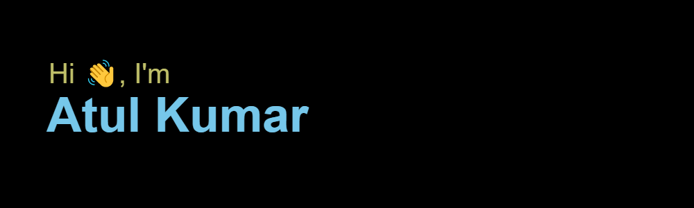

<!-- <h2 align='center'>Atul Kumar @ atulkumar1101</h2>

<b>Graduate Student at Silicon Institute of Technology</b>
 -->

<h2>Hey! 👋</h2>

I'm Atul Kumar! 
- <i>Currently:</i> CS Student at Silicon Institute of Technology at Bhubaneswar. 

<h2>👀 Stats</h2>

  
  

  <b><em>GitHub Stats:</em></b>  
       
  <b><em>Programming activity (Last 7 days):</em></b>  
    
  

<h2> Atul Kumar⚡:</h2>

I'm a Computer Science Student living in Bhubaneswar, Odisha, I love to read, enjoy music and explore nature outdoors. If you are around Bhubaneswar, drop an email and let's catch-up over Coffee!
 
- Know more about me: [About Atul kumar](https://atulkumar1101.github.io/Portfolio/)

<h2>📫 How to reach me:</h2>

 
